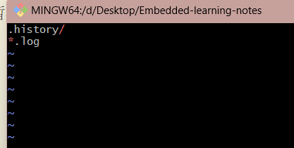

# 文件操作

## 一、git diff --查看文件差异

git diff 有一下使用场景：

- 查看工作区、暂存区、本地仓库之间的差异。
- 查看文件在两个特定版本之间的差异。
- 查看文件在两个分支之间的差异。

](<git diff.jpg>)](<../Images/git diff.jpg>)
&emsp;

### 1. 查看工作区和暂存区的文件差异：

默认情况下，git diff 命令只会显示工作区和暂存区之间的差异。
](../Images/image-12.png)

使用 git add 添加修改到暂存区，再次使用 git diff 命令，可以看到暂存区和本地仓库之间没有差异。
](../Images/image-11.png)

&emsp;

### 2. 查看文件在工作区和版本库之间的差异：

```c
git diff HEAD

//HEAD表示当前版本，即最近一次提交的内容，也可以使用 commit id 代替 HEAD
```

](../Images/image-13.png)

因为文件修改只是添加到了暂存区，并没有提交到本地仓库，所以差异还是存在的，如果使用 git commit 提交后，是什么情况：
](../Images/image-14.png)
可见工作区和版本库之间的差异已经没有了。

&emsp;

### 3. 查看暂存区和版本库之间的差异：

```dotnetcli
git diff --cached
```

&emsp;

### 4. 查看两个特定版本之间的差异：

```c
git diff 版本号1 版本号2

//可以使用HEAD和HEAD~比较当前版本和上一个版本差异
git diff HEAD~ HEAD

//加上指定文件名查看特定文件差异：
git diff 版本号1 版本号2 文件名
```

> HEAD~1 表示当前版本和上一个版本,HEAD~2 表示上上个版本...

](../Images/image-15.png)

### 5. 查看两个分支之间的差异：

```dotnetcli
git diff 分支名1 分支名2
```

&emsp;

## 2. git rm--删除文件

](<../Images/git rm.jpg>)
假如仓库中有一个文件 file1.txt，现在我想删除仓库中的这个文件

### 1. 从工作区删除：

```c
//1.删除工作区的file1.txt文件
rm file1.txt
//2.添加修改到暂存区
git add file1.txt
//3.提交到本地仓库
git commit -m "delete file1.txt"
```

可以看出，这样的方式去删除仓库中的一个文件还是比较麻烦的，因为需要先删除工作区，然后再添加到暂存区，最后提交到本地仓库。

### 2.使用 git rm 命令：

```c
git rm file1.txt
//使用--cached参数,只删除暂存区文件,保留工作区文件
git rm --cached filename
```

同时也会删除工作区中的 file1.txt 文件。
](../Images/image16.png)

这样删除之后记得提交，否则版本库中还是存在这个文件。

&emsp;

## 3. .gitignore 文件--忽略文件

.gitignore 文件用于告诉 Git 哪些文件或目录应该被忽略，不纳入版本控制。这些文件通常是一些不需要被跟踪的临时文件、自动生成的文件、依赖库、缓存文件等。在项目中使用 .gitignore 文件可以使你的仓库更整洁，并确保不会意外提交不需要的文件。

忽略文件或者目录都是可以的:


.gitignore 文件生效的规则如下：
忽略列表中的文件或目录没有在被忽略之前被添加到版本库中。否则，它们不会被忽略。  
 假如我有一个 1.log 文件，我把它添加到版本库中，然后我创建了一个.gitignore 文件，并在其中写入\*.log，此时，1.log 不会被忽略，就是一个先后顺序。

`.gitignore` 文件中的匹配规则用于告诉 Git 哪些文件和目录应该被忽略，不包括在版本控制中。这些规则可以包括文件名、通配符和目录路径。以下是`.gitignore` 文件的匹配规则：

1. **文件名匹配**：

   - 在`.gitignore` 文件中列出的文件名将被忽略，例如：`file.txt` 将匹配并忽略名为 `file.txt` 的文件。
   - 例如：`file.txt`。

2. **通配符匹配**：

   - `.gitignore` 支持两种通配符：
     - `*`：匹配零个或多个字符，例如 `*.txt` 将匹配所有扩展名为 `.txt` 的文件。
     - `?`：匹配一个字符，例如 `?.txt` 将匹配单个字符加上扩展名为 `.txt` 的文件。
   - 例如：`*.log`、`temp?.txt`。

3. **目录路径匹配**：

   - 你可以指定目录路径来匹配整个目录及其下的所有文件和子目录。
   - 以斜杠 `/` 开头的规则表示从仓库根目录开始匹配，而不是相对于当前 `.gitignore` 文件所在的目录。
   - 例如：`/build/` 将匹配根目录下的 `build/` 目录及其所有内容。

4. **否定规则**：

   - 以 `!` 开头的规则表示否定规则，即不忽略匹配的文件。
   - 例如：`!important.txt` 将取消对 `important.txt` 文件的忽略。

5. **注释**：
   - 使用 `#` 符号可以在 `.gitignore` 文件中添加注释。`#` 符号后面的内容会被视为注释，不会被匹配或解释为规则。
   - 例如：`# 这是一个注释`。

示例 `.gitignore` 文件：

```plaintext
# 忽略所有 .log 文件
*.log

# 忽略所有 .tmp 文件夹
*.tmp/

# 忽略 build 目录及其内容
/build/

# 不忽略 important.txt 文件
!important.txt
```

请注意，`.gitignore` 文件中的规则是逐行解析的，从上到下匹配。第一个匹配到的规则将决定文件是否被忽略。因此，更具体的规则通常应放在文件开头，以避免被后续规则覆盖。
