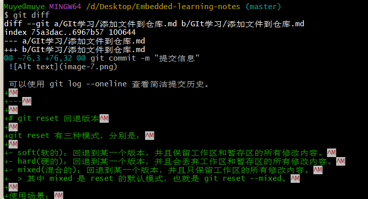

# 文件操作

## 一、git diff --查看文件差异

git diff 有一下使用场景：

- 查看工作区、暂存区、本地仓库之间的差异。
- 查看文件在两个特定版本之间的差异。
- 查看文件在两个分支之间的差异。

](<git diff.jpg>)](<../Images/git diff.jpg>)
&emsp;

### 1. 查看工作区和暂存区的文件差异：

默认情况下，git diff 命令只会显示工作区和暂存区之间的差异。
](../Images/image-12.png)

使用 git add 添加修改到暂存区，再次使用 git diff 命令，可以看到暂存区和本地仓库之间没有差异。
](../Images/image-11.png)

&emsp;

### 2. 查看文件在工作区和版本库之间的差异：

```c
git diff HEAD

//HEAD表示当前版本，即最近一次提交的内容，也可以使用 commit id 代替 HEAD
```

](../Images/image-13.png)

因为文件修改只是添加到了暂存区，并没有提交到本地仓库，所以差异还是存在的，如果使用 git commit 提交后，是什么情况：
](../Images/image-14.png)
可见工作区和版本库之间的差异已经没有了。

&emsp;

### 3. 查看暂存区和版本库之间的差异：

```dotnetcli
git diff --cached
```

&emsp;

### 4. 查看两个特定版本之间的差异：

```c
git diff 版本号1 版本号2

//可以使用HEAD和HEAD~比较当前版本和上一个版本差异
git diff HEAD~ HEAD

//加上指定文件名查看特定文件差异：
git diff 版本号1 版本号2 文件名
```

> HEAD~1 表示当前版本和上一个版本,HEAD~2 表示上上个版本...

](../Images/image-15.png)

### 5. 查看两个分支之间的差异：

```dotnetcli
git diff 分支名1 分支名2
```
