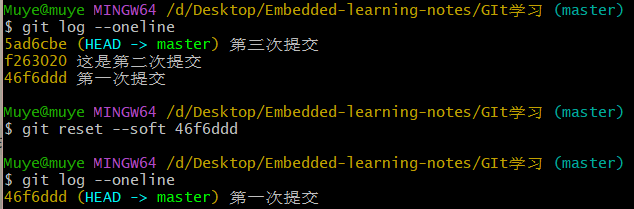
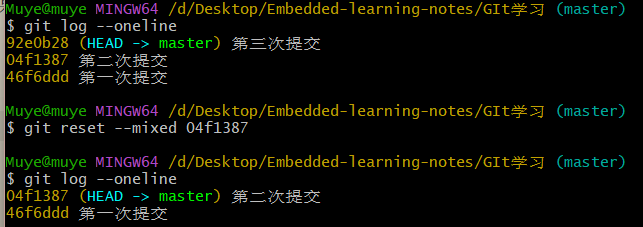

# 添加文件到仓库

用到的命令：

```c
//初始化仓库
git init
//查看仓库状态
git status
//添加文件到暂存区
git add
//提交文件到仓库
git commit
```

&emsp;

## 1. git status --查看仓库状态

 ](../Images/image-2.png)
可见，当前仓库中没有任何文件，所以需要添加文件到仓库。
工作区所有文件状态均为未跟踪。

&emsp;

## 2. git add --添加文件到暂存区

```c
//添加文件到暂存区
git add 文件名
    //@其中文件名可以使用通配符，例如：
    git add *.txt     //添加所有.txt文件
    git add .         //添加所有文件

//添加目录到暂存区
git add 目录名
```

](../Images/image-3.png)
可见，Linux 学习笔记目录被添加到了暂存区，等待被提交。

还可以使用命令将暂存区的文件或者目录删除（取消暂存）：

```c
git rm --cached 文件名
git rm -r --cached 目录名
```

](../Images/image-4.png)

> 有的时候 git add 会报错，比如：  
> warning: in the working copy of 'GIt 学习/git 的安装和配置.md', CRLF will be replaced by LF the next time Git touches it  
> warning: in the working copy of 'GIt 学习/新建仓库.md', CRLF will be replaced by LF the next time Git touches it  
> 就是说，当前工作区中存在文件换行符不统一的情况，需要进行统一。

一般可以忽略，使用命令：

```c
git config --global core.autocrlf false
```

&emsp;

## 3. git commit --提交文件到仓库

使用 git commit 命令提交文件到仓库，需要输入提交信息：

> git commit 是提交暂存区的内容到仓库，所以需要先使用 git add 命令将文件添加到暂存区。

```c
git commit -m "提交信息"
```

](../Images/image-5.png)

如果没有指定提交信息，则会进入一个交互界面（vim），需要输入提交信息:  
](../Images/image-6.png)
输入提交信息后，保存并退出即可，提交成功。

&emsp;

## 4. git log --查看提交历史

](../Images/image-7.png)

可以使用 git log --oneline 查看简洁提交历史。

&emsp;

## 5. 查看仓库文件

```c
//列出仓库的文件和目录
git ls-files
//查看指定文件内容
cat filename
```

---

&emsp;

# git reset 回退版本

git reset 有三种模式，分别是：

- soft(软的)：回退到某一个版本，并且保留工作区和暂存区的所有修改内容。
- hard(硬的)：回退到某一个版本，并且会丢弃工作区和暂存区的所有修改内容。
- mixed(混合的)：回退到某一个版本，并且只保留工作区的所有修改内容。
  > 其中 mixed 是 reset 的默认模式，也就是 git reset --mixed。

](<git reset.jpg>)](<../Images/git reset.jpg>)
使用场景：

```c
//hard一般是彻底放弃本地修改
git reset --hard ...

//soft一般都是需要回退版本重新提交，比如觉得多次提交没有意义，要撤回来一次提交
git reset --soft ...

//mixed一般是需要回退版本，但是不提交，比如回退到某个版本，但是不提交，继续开发
git reset --mixed ...
```

](../Images/image-8.png)
](../Images/image-9.png)

> 可以使用 git reflog 命令查看所有分支的所有操作记录，包括已经删除了的 commit。

---

&emsp;

# 补充

Git 默认情况下在命令行中不会正确地显示中文字符，导致文件名或路径中的中文字符显示为乱码。这是因为 Git 默认使用的字符编码可能与你的终端编码不匹配。  
在终端中，可以设置 Git 使用 UTF-8 字符编码，以便正确地显示中文字符。可以运行以下命令来配置 Git：

```dotnetcli
git config --global core.quotepath false
git config --global gui.encoding utf-8
git config --global i18n.commit.encoding utf-8
git config --global i18n.logoutputencoding utf-8
```

效果：  
](../Images/image-10.png)
