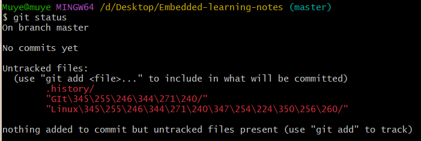
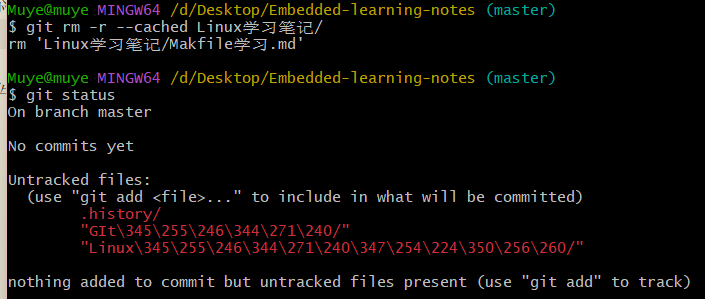
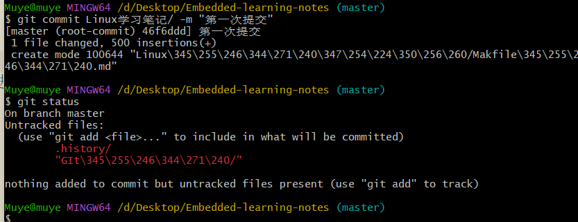

# 添加文件到仓库

用到的命令：

```dotnetcli
# 初始化仓库
git init
# 查看仓库状态
git status
# 添加文件到暂存区
git add
# 提交文件到仓库
git commit
```

## 1. git status --查看仓库状态

  
可见，当前仓库中没有任何文件，所以需要添加文件到仓库。
工作区所有文件状态均为未跟踪。

## 2. git add --添加文件到暂存区

```dotnetcli
# 添加文件到暂存区
git add 文件名
    @其中文件名可以使用通配符，例如：
    git add *.txt     //添加所有.txt文件
    git add .         //添加所有文件

# 添加目录到暂存区
git add 目录名
```


可见，Linux 学习笔记目录被添加到了暂存区，等待被提交。

还可以使用命令将暂存区的文件或者目录删除（取消暂存）：

```dotnetcli
git rm --cached 文件名
git rm -r --cached 目录名
```



> 有的时候 git add 会报错，比如：  
> warning: in the working copy of 'GIt 学习/git 的安装和配置.md', CRLF will be replaced by LF the next time Git touches it  
> warning: in the working copy of 'GIt 学习/新建仓库.md', CRLF will be replaced by LF the next time Git touches it  
> 就是说，当前工作区中存在文件换行符不统一的情况，需要进行统一。

一般可以忽略，使用命令：

```dotnetcli
git config --global core.autocrlf false
```

## 3. git commit --提交文件到仓库

使用 git commit 命令提交文件到仓库，需要输入提交信息：

> git commit 是提交暂存区的内容到仓库，所以需要先使用 git add 命令将文件添加到暂存区。

```dotnetcli
git commit -m "提交信息"
```



如果没有指定提交信息，则会进入一个交互界面（vim），需要输入提交信息:  

输入提交信息后，保存并退出即可，提交成功。

## 4. git log --查看提交历史


可以使用 git log --oneline 查看简洁提交历史。
